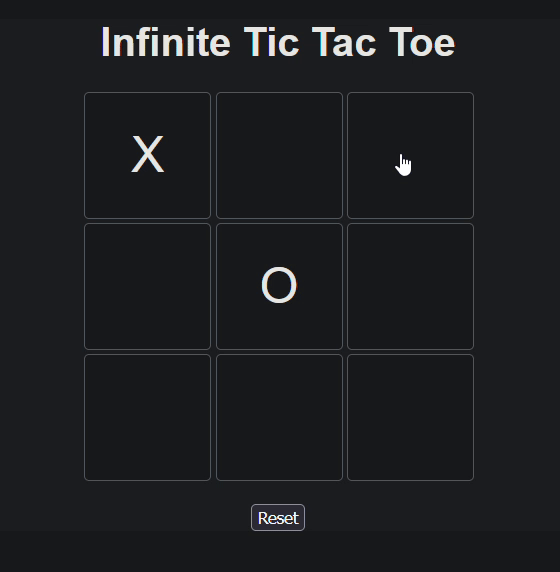

# ♾️ Infinite Tic Tac Toe

A creative twist on the classic Tic Tac Toe — where every new move **erases the oldest one** after the board fills, making it an **endless memory-based battle** until someone wins.

---

### 🔗 Live Demo  
👉 [Play Now](https://nova-cmd-oss.github.io/Infinite_tic-tac-toe/)

---

### 🎥 Demo Preview

<!-- Option A: If using GIF -->

---

### 🧠 Game Mechanics

- Classic 3×3 Tic Tac Toe board
- After **6 moves**, each new move **removes the oldest** move
- The next-to-vanish cell is **visually highlighted** before disappearing
- Designed for **infinite play until a winner is declared**

---

### ✨ Features

- ♻️ Vanishing mechanic that keeps the game dynamic
- 🧠 Memory element for strategic thinking
- ⚡ Clean, responsive UI
- ☑️ Reset button to restart anytime

---

### 🛠 Built With

- HTML
- CSS (minimal, just for grid & visual clarity)
- JavaScript (DOM manipulation & game logic)
